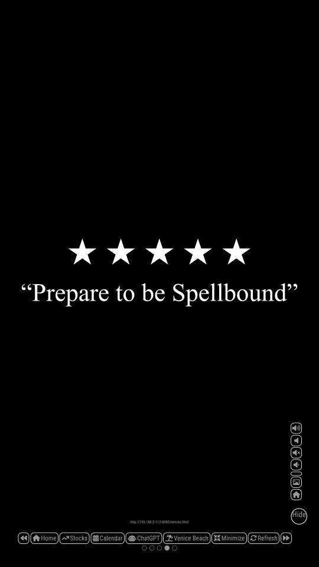

# MMM-DriveVideos

## Preview



MagicMirror module that plays videos from a Google Drive folder using rclone.

No API keys. No Google developer setup. Simple browser-based authentication.

---

## Features

- Plays videos from Google Drive
- Uses rclone with no API keys required
- Automatic background syncing with no cron needed
- Simple setup for non-technical users
- Supports linear and random playback
- Optional sound control

---

## Installation

Navigate to your MagicMirror modules folder:

cd ~/MagicMirror/modules

Clone the repository:

git clone https://github.com/Dresch360/MMM-DriveVideos.git

Make the setup script executable:

chmod +x MMM-DriveVideos/connect

---

## Configuration

Add this to your config.js:
```js
{
  module: "MMM-DriveVideos",
  position: "fullscreen_above",
  config: {
    updateInterval: 2 * 60 * 1000,
    playMode: "linear", // "linear" or "random"
    muted: true // true = no sound, false = sound on
  }
},
```
---

## Configuration Options

| Option | Description | Default |
|--------|-------------|---------|
| updateInterval | How often to sync with Google Drive in milliseconds | 2 * 60 * 1000 |
| playMode | Playback order | "linear" |
| muted | Enable or disable sound | true |

---

## Setup (First Time)

1. Minimize MagicMirror  
   Press: Ctrl + m

2. Open Terminal

3. Run:

~/MagicMirror/modules/MMM-DriveVideos/connect

4. When prompted, type exactly:

- Use web browser? → y  
- Shared Drive? → n  

A browser window will open. Sign into your Google account and click Continue.

---

## Adding Videos

### Smartphone

1. Open the Google Drive app  
2. Open the folder: mirror-videos  
3. Tap + then Upload  
4. Select your videos  

Videos will appear automatically within a few minutes.

### Computer

1. Go to https://drive.google.com  
2. Open the folder: mirror-videos  
3. Drag and drop your videos  

---

## Notes

- The Google Drive folder mirror-videos is created automatically during setup  
- Folder name must be exactly mirror-videos in lowercase  
- Only MP4 files are supported  
- Recommended maximum resolution: 1080p  
- Videos autoplay  
- Playlist updates apply after the current video ends  
- Updates happen automatically about every 2 minutes  

---

## Reset

To remove videos and disconnect Google Drive:

rm -rf ~/MagicMirror/modules/MMM-DriveVideos/public/videos/*
rm -f ~/.config/rclone/rclone.conf
pm2 restart MagicMirror

---

## License

MIT License
